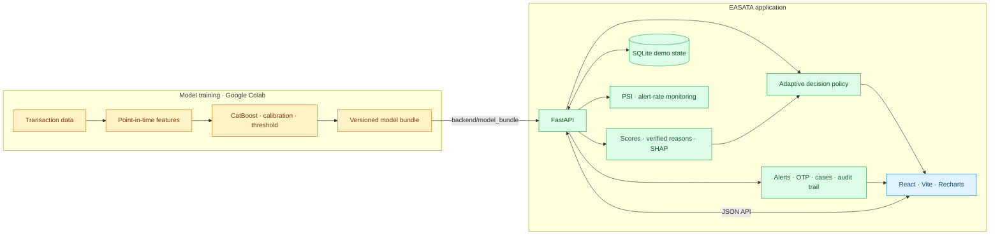
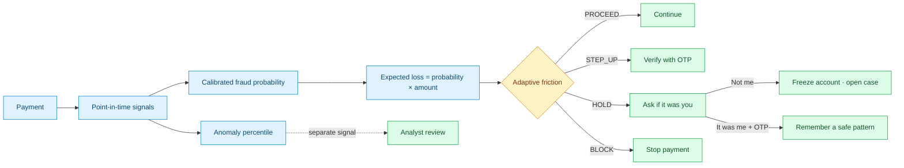
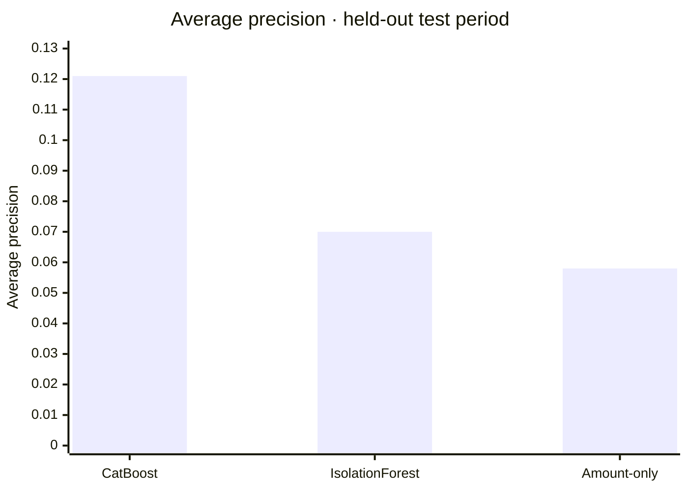
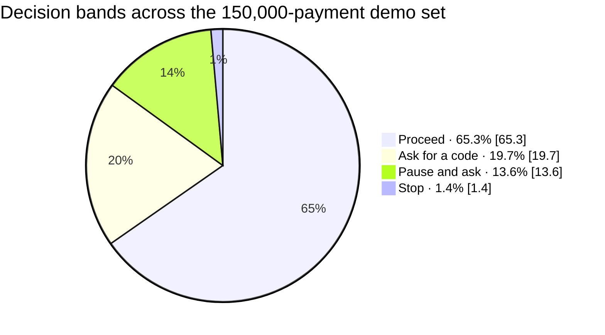

# EASATA

### Every alert has a story.

An explainable transaction-risk demo that turns a suspicious payment into a verified explanation and a customer response workflow, from **"Was this you?"** to a simulated freeze and case.

<p align="center">
  <a href="https://easata.onrender.com"></a>
  <a href="https://easata.onrender.com/api/health"></a>
  
  
</p>

<p align="center">
  <a href="https://easata.onrender.com"></a>
</p>

> **Watch it in motion:** the landing page's globe and payment routes react as you scroll. [Launch the live experience](https://easata.onrender.com).
>
> **Synthetic data, simulated outcomes.** Trained on the public synthetic [Bank Transaction Fraud Detection Dataset](https://www.kaggle.com/datasets/nafiulislam490/bank-transaction-fraud-detection-dataset). No real bank, customer, or payment is involved. A score means "flagged for review," never proof of fraud. Freezes, holds, credits, and emails are simulated.

## System Map



## From Payment to Response



## Quick start

Requires **Python 3.10–3.12** (tested on 3.11). The model libraries must match the versions the notebook printed
(`backend/model_bundle/config.json → versions`); `requirements.txt` pins them.

**Bash (Linux/macOS)**
```bash
cd backend
python3 -m venv .venv && source .venv/bin/activate
pip install -r requirements.txt
# put your bundle in place (skip if backend/model_bundle/ already has the files)
unzip -o /path/to/model_bundle.zip -d model_bundle
uvicorn app.main:app --port 8000            # first start loads 150k transactions (~30 s)
```

**PowerShell (Windows)**
```powershell
cd backend
py -3.11 -m venv .venv; .\.venv\Scripts\Activate.ps1
pip install -r requirements.txt
Expand-Archive -Force C:\path\to\model_bundle.zip model_bundle
uvicorn app.main:app --port 8000
```

Then open **http://localhost:8000/docs**. The bank-ops key is printed in the log and saved to `backend/data/ops_api_key.txt`
(or set `OPS_API_KEY`). Settings: copy `backend/.env.example` to `backend/.env`.

**Frontend** (Node 20+, second terminal)
```bash
cd frontend
npm install
npm run dev                                  # http://localhost:5173 (proxies /api to :8000 and adds the ops key)
```
`/` is the EASATA landing page (scroll-animated globe video). The console has Overview, Alerts, Simulate, Inbox, Cases and
Evaluation, and customers open `/respond?token=…` from the "Was this you?" email. `npm run build` writes `frontend/dist`,
which the API also serves at http://localhost:8000 after a restart (then paste the ops key via the 🔑 button).

| Task | Command (inside `backend/`, venv active) |
|---|---|
| Run API | `uvicorn app.main:app --port 8000` |
| Tests | `python -m pytest -q` |
| Full demo story (server running) | `python scripts/demo_flow.py` |
| Reset all workflow state | stop server, delete `data/app.db*`, start again |
| Optional real mail inbox | `docker run -p 8025:8025 -p 1025:1025 axllent/mailpit` → http://localhost:8025 |
| Retrain | open `notebook/fraud_catboost_colab.ipynb` in Colab (T4 GPU) → Run all → replace `model_bundle/` |

## Features

**Detection and explanation**
- CatBoost (Optuna-tuned, class-weighted), isotonic-calibrated probability, threshold chosen on validation.
- Isolation Forest anomaly **percentile** shown separately, never as a probability.
- Point-in-time per-customer features: amount vs usual, amount z-score, activity in 1h/24h/7d, unusual hour/day
  for *this* customer, first-time city/country/device/payment method/merchant, limited-history flag.
- **Verified reasons**: every reason is a template filled with row/baseline values; a verifier re-reads the data and
  checks every number in the text. Unverifiable reasons are dropped, and the API returns `numbers_verified`.
- **Two audiences**: analyst view (SHAP by feature and family, log-odds) and a **customer-safe message**
  (facts only, no scores or thresholds, so attackers learn nothing about the model).
- **What changed?** (replace a reason family with typical values → re-score) and a **minimal counterfactual**
  ("would not have been flagged if failed_attempts were 0"). Both are labelled as hypothetical, not causal.

**Response workflow (security-first)**
- **Adaptive friction**: PROCEED / STEP_UP (OTP) / HOLD ("Was this you?") / BLOCK, from probability and
  **expected loss = probability × amount**; the review queue is sorted by expected loss.
- **"Was this you?" email** with a single-use, 30-minute, 256-bit link token (only its SHA-256 is stored).
- **Opening the link changes nothing** (email scanners pre-open links); actions need a POST from a button.
- **Asymmetric trust**: "Not me" (freeze) is one click; "It was me" and unfreeze need an **OTP on another channel**,
  so an attacker who controls the email cannot clear the alert. OTPs are HMAC'd with a server secret, expire in
  5 minutes, and lock after 5 wrong tries.
- **Not me** in one atomic transaction: freeze (simulated), revoke sessions, require credential reset, hold the disputed
  payment, revoke trusted patterns, list related transactions, open a case, record feedback, email a confirmation.
  Double clicks are idempotent.
- **Case management** with RBI-framework-style deadlines: zero liability if reported within 3 working days of the
  bank's alert, shadow credit within 10 working days, resolution within 90 days. Countdowns, overdue flags, a validated
  state machine and an **append-only audit log** (enforced by SQLite triggers).
- **Trusted-pattern memory**: after an OTP-confirmed "It was me", similar payments (merchant, domestic/international,
  device) get one level less friction for 14 days. BLOCK is never lowered, patterns expire, and customers can revoke them.
- A **frozen account blocks** new (simulated) payments.

**Platform**
- Pending vs completed simulation: pending never writes anything; completed becomes history for later transactions.
- Idempotency keys, structured errors, request IDs, rate limits, `X-Ops-Key` for bank-ops endpoints,
  `Referrer-Policy: no-referrer`, `Cache-Control: no-store` on link pages.
- **Model health**: monthly alert rate and score, PSI drift per key feature.
- **Feedback loop**: `GET /api/ops/feedback.csv` exports customer-confirmed labels with features for retraining.
- Replay stream with cursor; demo inbox for emails/SMS.

## Measured results (test period Apr–Dec 2024, from `model_bundle/evaluation.json`)

| Model | Avg precision | ROC-AUC | Precision | Recall | Alerts / 1,000 |
|---|---|---|---|---|---|
| **CatBoost (calibrated)** | **0.121** | **0.728** | 0.136 | 0.351 | 141.9 |
| Isolation Forest | 0.070 | 0.574 | 0.077 | 0.269 | 191.1 |
| Amount-only baseline | 0.058 | 0.515 | 0.055 | 1.000 | 1000.0 |

### Model Comparison



### Friction Mix



The fraud base rate is 5.5%, so random guessing gives an average precision of about 0.055. Calibration is good
(Brier 0.050; predicted ≈ observed per decile). Numbers come from the notebook run; retraining changes them, and the API
always serves the bundle's own `evaluation.json`.

**What the data allows (reported honestly)**
- Even the riskiest combination of signals in this dataset (night, 2+ failed attempts, international, PIN change)
  reaches only about 22% fraud, so no model can reach high precision here.
- Transaction amount carries no signal (AUC 0.515), and the six `fraud_type` values are statistically identical, so the
  explanation audit by fraud type is not meaningful.
- Per-customer habit features have low importance because the generator gives customers no stable habits. The features
  are verified against brute-force recomputation and leakage tests.
- PSI drift is "stable" across months, which is expected for a uniform synthetic generator.

## One-minute demo script

1. **Alerts** (sorted by expected loss): open the top alert. Show the band (BLOCK), the verified reasons with the ✓ badge,
   the SHAP families, the counterfactual ("if failed attempts were 0 → 0.09") and "What changed?".
2. Click **Send "Was this you?"**. Open the **Inbox**: plain, customer-safe wording, with no scores in it.
3. Open the link: nothing changes until a button is pressed. Click **Not me** → account **frozen (simulated)** → case opens
   with zero-liability status, shadow-credit and resolution deadlines, and the automatic actions timeline.
4. **Simulate** another payment from that customer: **BLOCK (account frozen)**.
5. Another customer: **It was me** asks for an OTP (on the phone, not the email) → trusted pattern created → the same
   pattern drops from HOLD to STEP_UP. Say: "BLOCK is never lowered."
6. **Cases**: move to INVESTIGATING → SHADOW_CREDITED; show the audit log. **Evaluation**: honest metrics and limitations.

(`python scripts/demo_flow.py` runs this story against the API and prints each step.)

## Tests (31)

`python -m pytest -q` checks:
- the bundle reproduces saved scores, and the alert flag matches the notebook;
- no label or ID columns are used as features;
- every number in explanations traces to data, and the verifier rejects invented numbers;
- customer messages carry no model internals;
- history features match brute force and don't change when future rows are added; cold-start flags work;
- viewing a link is read-only; tokens are never stored in plaintext; expired, invalid and used links are rejected;
- "Not me" is idempotent; the frozen account blocks payments;
- OTP is required, expires and locks after 5 tries; unfreeze needs an OTP;
- case transitions are valid, audit rows can't be changed, and working-day deadlines are correct;
- decision bands, trusted-pattern lowering, revocation and expiry work;
- pending simulation writes nothing; committed simulation updates history;
- idempotency keys, structured validation errors, rate limits and the dashboards work.

## Limitations

- **Synthetic data**: the realism is limited by the generator (see "What the data allows"). The label comes from the
  generator, not from real investigations.
- **Simulated outcomes**: no real payment is frozen, held or credited. Email/SMS go to an outbox (and optionally Mailpit).
- **History starts in the test period**: the bundle holds only Apr–Dec 2024, so simulated customers' in-app history
  starts there. Training-time history features came from the full dataset.
- **Deadlines** follow the RBI framework's structure but skip weekends only (no bank holidays). This is not legal advice.
- **Demo endpoints expose secrets on purpose**: `GET /api/demo/inbox` shows the emails and SMS, including link tokens and
  OTPs, so the demo works without a phone or mail server. Set `DEMO_MODE=0` anywhere that isn't a local demo. Dashboard
  read endpoints are unauthenticated in this demo.
- **Single-process demo**: the in-memory rate limiter and SQLite suit one server. Production would use PostgreSQL,
  a shared rate limiter, real authentication for analysts, and a real SMS/email provider.
- **Trusted patterns** are coarse (merchant category × domestic/international × device type).
